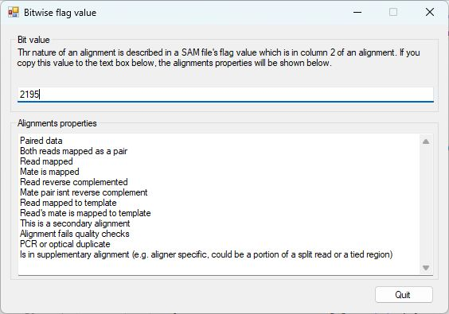

# SAM Bitwise mapping value

When aligning NGS data to a reference sequence, the aligner records an array of data on each reads alignment and when present it's mate pair. This data is stored as single 32 bit integer, with each bit linked to a statement as listed in the Table 1.  

While the use of a single value to hold up to 32 pieces of data is very memory efficent, it isn't very easy to read when scanning reads mapped to a specific region. Consequenlty, SAM_Bitwise_mapping_value.exe allows you to rapidly determine the nature of the alignment.   

Simply enter the alignments Flag value in the upper text area and the alignments description will appear in the lower field (Figure 1).

  

|Decimal value of bit|Binary valye|Description|
|-|-|-|
|1	|000000000001|	template having multiple templates in sequencing (read is paired)|
|2	|000000000010|	each segment properly aligned according to the aligner (read mapped in proper pair)|
|4	|000000000100|	segment unmapped (read1 unmapped)|
|8	|000000001000|	next segment in the template unmapped (read2 unmapped)|
|16	|000000010000|	SEQ being reverse complemented (read1 reverse complemented)|
|32	|000000100000|	SEQ of the next segment in the template being reverse complemented (read2 reverse complemented)|
|64	|000001000000|	the first segment in the template (is read1)|
|128	|000010000000|	the last segment in the template (is read2)|
|256	|000100000000|	not primary alignment|
|512	|001000000000|	alignment fails quality checks|
|1024	|010000000000|	PCR or optical duplicate|
|2048	|100000000000|	supplementary alignment (e.g. aligner specific, could be a portion of a split read or a tied region)|

**Table 1** Bitwise flag values as reported in [Sam file format document](https://en.wikipedia.org/wiki/SAM_(file_format)).
